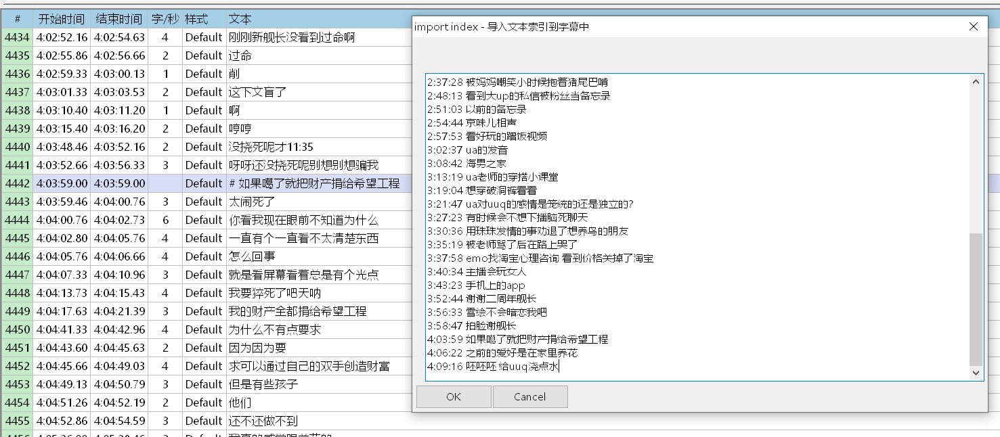
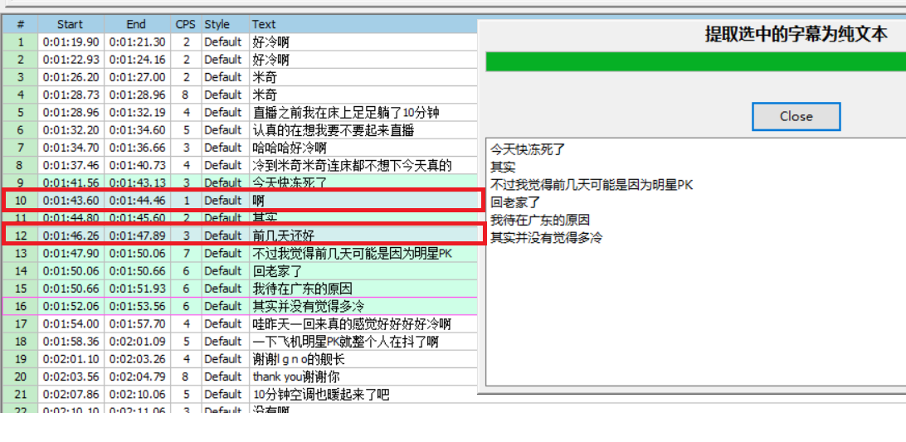
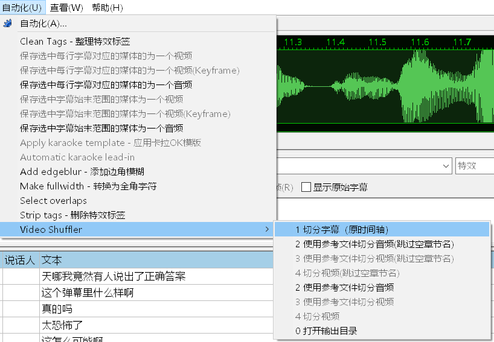

# Video Shuffler for Aegisub
Script for Aegisub to cut video and voice files.   
在Aegisub中用字幕切割视频和音频文件。  
 

## 用法
1. 下载[ffmpeg](https://ffmpeg.org/download.html)  
2. 解压并把ffmpeg添加到系统环境变量中
3. 下载[本仓库](https://github.com/tumuyan/video-shuffler-for-aegisub)文件，复制到aegisub的`automation\autoload`目录中
4. 打开Aegisub，并加载字幕和视频/音频文件，选择`自动化-对应菜单命令`


## ffmpeg_cut.lua
使用ffmpeg对选中的字幕所对应的媒体文件进行切割。  
包含多种模式，根据描述有如下特性：

1. `保存选中每行字幕对应的媒体的为一个`和`保存选中字幕始末范围的媒体为一个`这两组命令,控制输出的结果是一个文件还是多个文件。
2. `视频`,`视频（不重编码）`和`音频`，即输出视频（速度较慢），还是使用`-codec copy`参数输出视频（时间点可能不准确），还是输出音频。通常输出的格式与源文件的格式相同。

这个脚本还塞入了以下2个功能：
1. `合并视频和音频`。把打开的视频中的音频，替换为打开的音频。
2. `合并视频和字幕`。为打开的视频嵌入硬字幕。 


## import_index.lua
把带时间信息的文本粘贴到文本框中，导入到字幕时间轴上，生成章节信息



## get_selected_text.lua
提取选中的字幕为纯文本（跳过Comment行和空行）


## split_chapter.lua
使用章节信息（类型为comment，text内容为# 开头）分割视频和字幕（分割字幕暂未实装）

## video_shuffler.lua
使用[video shuffler（洋片箱）](https://github.com/tumuyan/video-shuffler)对字幕和视频进行处理。  
由于洋片箱是一个Python工具，因此必须额外安装Python环境以及洋片箱这个工具，并且在脚本中设置洋片箱的路径，即脚本中的如下内容：
```
video_shuffler = "C:\\prg\\video-shuffler\\main.py"
```

包含多种模式，根据描述有如下特性：
1. 切分字幕（原时间轴）即只切分字幕，不切分媒体文件。此步骤会在字幕所在文件夹生成一个新文件夹，所有文件都会保存在这个文件夹内。其中名称为` content.txt`是一个章节目录，可以通过删除其中不需要的行，然后使用包含“参考文件”的命令时，只输出指定章节名的视频内容
2. 打开输出目录。只对Windows系统有效，打开生成的新文件夹



## 存在的问题
1. 部分文件在不同版本的Aegisub中加载后，存在时间轴错位的问题。这会导致导出结果的时间点有问题。