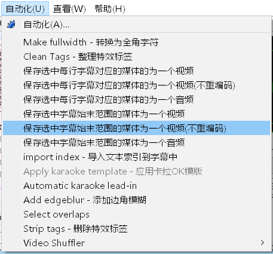

# Video Shuffler for Aegisub
Script for Aegisub to cut video and voice files.   
在Aegisub中用字幕切割视频和音频文件。

### 用法
1. 下载[ffmpeg](https://ffmpeg.org/download.html)  
2. 解压并把ffmpeg添加到系统环境变量中
3. 下载本仓库文件，复制到aegisub的`automation\autoload`目录中
4. 打开Aegisub，并加载字幕和视频/音频文件，选择`自动化-对应菜单命令`



## ffmpeg_cut.lua
使用ffmpeg对选中的字幕所对应的媒体文件进行切割。  
包含多种模式，根据描述有如下特性：

1. `保存选中每行字幕对应的媒体的为一个`和`保存选中字幕始末范围的媒体为一个`,即输出的结果是一个文件还是多个文件。
2. `视频`,`视频（keyframe）`和`音频`，即输出视频（速度慢），还是根据关键帧输出视频（时间点可能有问题，输出的音频可能错位，时间过短可能没有画面），还是输出音频。通常输出的格式与源文件的格式相同

## video_shuffler.lua
使用[video shuffler（洋片箱）](https://github.com/tumuyan/video-shuffler)对字幕和视频进行处理。  
由于洋片箱是一个Python工具，因此必须额外安装Python环境以及洋片箱这个工具，并且在脚本中设置洋片箱的路径，即脚本中的如下内容：
```
video_shuffler = "C:\\prg\\video-shuffler\\main.py"
```
